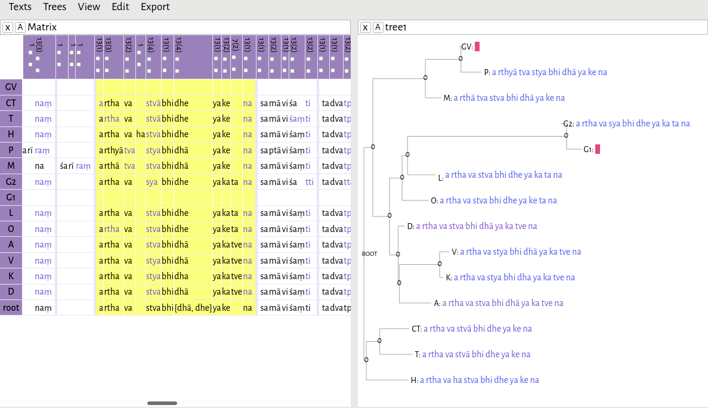

# Summary

For the vast majority of ancient and medieval texts, the original text itself is no longer extant in a material form. Instead, what we have are manuscripts which are copies of copies of copies, made over the course of hundreds or thousands of years, which accumulate errors and other changes each time they are copied by hand. In order to reconstruct the original text from these imperfect copies, scholars create a stemma — analogous to an evolutionary tree — in order to determine the relationships between manuscripts and to trace those textual changes over time.

# Statement of need

Due to the similarities in the methods used in the fields of textual reconstruction and evolutionary biology, textual scholars have begun to employ software created for biologists in order to analyze texts. Specifically, textual scholars are now using sequence alignment algorithms and phylogenetic tree-building packages to help with the reconstruction of ancient texts [@Salemans:2000; @Rodriguez:2007; @Maas:2013]. However, as bioinformatics becomes increasingly sophisticated, their models and algorithms have become more specific, and less applicable to non-biological sequences. 

`helayo` has been designed from the ground up to perform multiple sequence alignment specifically for Sanskrit texts. Since Sanskrit has been written in over a dozen different scripts, each with their own orthographic peculiarities depending on their time and place, `helayo` performs a crucial pre-processing step in which the texts are normalized so that they can be compared meaningfully [@Li:2017]. `helayo` can also tokenize texts either as individual characters or as _akṣaras_, since the Brahmic scripts used to write Sanskrit are abugidas, in which consonant and vowel pairs are written as a single unit.

In addition, a web-based `matrix editor` can be used to edit an alignment. It is also capable of automatically reconstructing a text based on an alignment and a phylogenetic tree, using the Fitch algorithm [@Fitch:1971]. A full tutorial, with example files, is available at [https://chchch.github.io/sanskrit-alignment/docs](https://chchch.github.io/sanskrit-alignment/docs).

# Implementation

`helayo` is written in Haskell, and implements the Center Star multiple sequence alignment algorithm [@Gusfield:1997, 347-350] with an affine gap penalty model [@align-affine]. It can be run in three different tokenization modes (character, akṣara, or whitespace-delimited word) and outputs a TEI XML file which can then be edited using the `matrix editor`.

The `matrix editor` is written in Javascript and can be used either online or offline. It loads both TEI XML alignments produced by `helayo` as well as phylogenetic trees in NeXML format, which can be used together to reconstruct a text.

# Discussion

Previous work on textual phylogeny has focused on texts in Western languages (e.g., [@Barbrook:1998]), and, consequently, the tools developed from those projects embody assumptions about how Western languages are spoken, written, and transmitted (e.g., [@collatex]), in the same way that tools produced for bioinformatics embody assumptions about biological sequences. While any set of sequences ― composed of text in various languages, of DNA, of proteins ― can be analyzed using the same fundamental algorithms, the results are meaningless unless we use domain-specific knowledge to refine those algorithms and to interpret those results. 

Although `helayo` has been designed specifically to align Sanskrit texts, each step of the process — normalization, tokenization, and sequence alignment — is architecturally distinct, and can be modified to work with other languages. Previously, textual scholars created alignments (or "collations") by hand, comparing different manuscripts to a reference text and using their own judgement to note down the most important differences. The process was slow, but, more importantly, it was not reproducible. By using formal algorithms to align texts, and, furthermore, by refining those algorithms to work with texts from a specific language and tradition, we can begin to create reproducible, testable models of how textual transmission actually works.

# References
